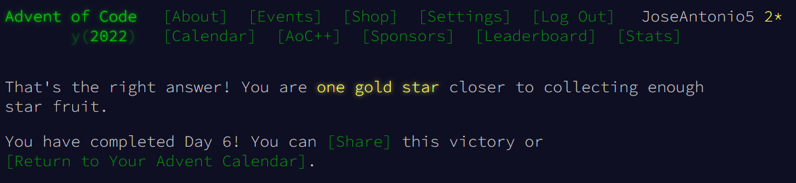

# Day 6 - Advent of Code 2022

### Solução [Day 6 - Advent of Code 2022](https://adventofcode.com/2022/day/6)

O código presente no arquivo *Solution_Jose_Antonio.py* é a minha solução para o exercício do link acima da plataforma Advent of Code.

  

Para a minha solução comecei criando duas variáveis globais (*NUM_SEQUENCE_PART_ONE* e *NUM_SEQUENCE_PART_TWO*) que são referentes às partes 1 e 2 do exercício. Para obter a solução basta mudar a variável no código.

  

Foi declarada uma função *find_start_of_packet* que recebe uma mensagem (string) como parâmetro e a percorre tendo i como o índice de cada caractere dessa string.

É feita uma verificação para ver se a mensagem chegou nos últimos 4 caracteres, visto que ela não poderá mais ser um start-of-packet caso seu tamanho seja menor do que 4.

É usado um *set()* para retornar os dados exclusivos daquela string (caracteres únicos presentes nos 4 elementos que estão sendo analisados na mensagem).

Como o *set()* só retorna os caracteres exclusivos, então caso o tamanho do retorno seja 4 quer dizer que os quatro elementos retornados são únicos, dessa forma, temos um start-of-packet

Caso o start-of-packet seja encontrado, é exibido o índice do marker

  

> Rigth answer Advent of Code 2022 Day 6

